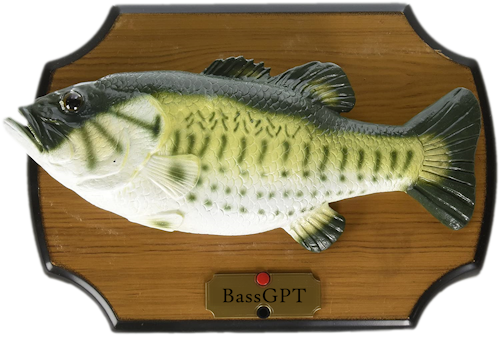

    

Your new favorite companion and assistant. BassGPT brings a refreshing feel to arti-fish-ial intelligence.

## Hardware and Technology

- [Big Mouth Billy Bass](https://en.wikipedia.org/wiki/Big_Mouth_Billy_Bass)
- [ESP8266MOD](https://en.wikipedia.org/wiki/NodeMCU)
- [URBEST 660V 10A Keylock Rotary Switch](https://www.amazon.com/URBEST-Momentary-Mushroom-Position-Rotary/dp/B01M0K8XY6)
- Java (frontend)
- C++ (backend)
- ElevenLabs TTS API
- Google Gemini API

## How it Works

The **Button Activated Switch System (BASS)** is initiated by inserting and twisting the key. This will wake up the Java application **[BassGPT](./bassgpt)**, which prompts the user for input. After the button is pressed, the response is sent to Gemini. The response from Gemini is then processed through ElevenLabs text-to-speech. Then, the generated audio file is processed into a buffer array representing mouth movements of processed audio levels every 100ms. This array is finally sent to the **[Frankenfish](./frankenfish)** backend through the API endpoints to activate the motors accordingly.
